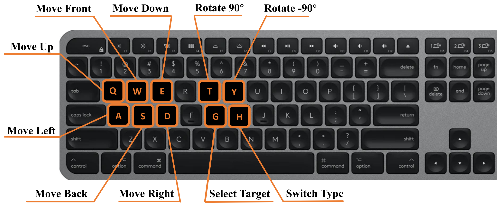

# Sequential Dexterity


## Table of Content
- [Overview](#overview)
- [Installation](#installation)
- [Quick demo](#quick-demo)
- [Training](#training)
- [Evaluation](#evaluation)
- [Acknowledgement](#acknowledgement)
- [Citations](#citations)
- [License](#license)

## Overview

This repository is the implementation code of the paper "Sequential Dexterity: Chaining Dexterous Policies for Long-Horizon Manipulation"([Paper](https://arxiv.org/abs/2309.00987), [Website](https://sequential-dexterity.github.io/), [Presentation](https://youtu.be/2mmqQYO4KlY)) by Yuanpei Chen*, Chen Wang*, Li Fei-Fei and C. Karen Liu at [The Movement Lab](https://tml.stanford.edu/) and [Stanford Vision and Learning Lab](http://svl.stanford.edu/). In this repo, we provide our full implementation code of quick demo, training, evaluation, and real-world system.

## Installation
* python 3.8
```	
conda create -n seqdex python=3.8
conda activate seqdex
```

* IsaacGym (tested with `Preview Release 3/4` and `Preview Release 4/4`). Follow the [instruction](https://developer.nvidia.com/isaac-gym) to download the package.
```	
tar -xvf IsaacGym_Preview_4_Package.tar.gz
cd isaacgym/python
pip install -e .
(test installation) python examples/joint_monkey.py
```
* SeqDex
```	
git clone https://github.com/sequential-dexterity/SeqDex.git
cd SeqDex
pip install -r requirements.txt
pip install -e .
```
* Trained checkpoint. Download from [Link](https://drive.google.com/file/d/1rfi257wjXhYr_MuDuPbyXU-GesWme-cP/view?usp=sharing).
```	
unzip seqdex_checkpoint.zip
mv checkpoint SeqDex/dexteroushandenvs/checkpoint
```

## Quick demo

<div align=center>
 
</div>

Here we provide a quick demo where you can interactively assign a LEGO building manual you prefer to the robot with the keyboard. The robot will load the trained checkpoints to perform the task. To get the best performance for this demo, the policy takes the full state information (object acceleration, motor velocity, ...) as inputs and is allowed to control the end-effector orientation, which is the policy before distillation for the real-world deployment. To start the demo, simply
```	
cd SeqDex/dexteroushand
python train_rlgames.py --task BlockAssemblyGUI --num_envs=1 --play
```

The control instructions are as follows:

<div align=center>

</div>

## Training
Taking the Block Assembly as an example, each sub-task and their order are BlockAssemblySearch->BlockAssemblyOrient->BlockAssemblyGraspSim->BlockAssemblyInsertSim. 

If you want to use the bi-directional optimization in our paper to train the BlockAssembly or ToolPositioning task, simply:

```	
python scripts/bi-optimization.py --task=[BlockAssembly / ToolPositioning]
```

Since each sub-task takes about 1~2 days to train, it may take a long time for the whole process, so we also provide a way to train each sub-task individually. When training each sub-task, run this line in `dexteroushandenvs` folder:

```	
python train_rlgames.py --task=[BlockAssemblySearch / BlockAssemblyOrient / BlockAssemblyGraspSim / BlockAssemblyInsertSim]   --num_envs=1024
```

The trained model will be saved to `runs` folder, and the terminal state of the task will be saved to `immediate_state`. These terminal states are also used to train the transition feasibility function (see our [paper](https://arxiv.org/abs/2309.00987)), using the following command: 

```	
python policy_sequencing/tvalue_trainer.py --task=[BlockAssemblySearch / BlockAssemblyOrient / BlockAssemblyGraspSim / BlockAssemblyInsertSim]
```

## Evaluation
To load a trained model and only perform inference (no training) in each sub-task, pass `--play` as an argument, and pass `--checkpoint` to specify the trained models which you want to load. Here is an example in BlockAssemblyGraspSim task:

```bash
python train_rlgames.py --task=BlockAssemblyGraspSim  --checkpoint=./checkpoint/block_assembly/last_AllegroHandLegoTestPAISim_ep_19000_rew_1530.9819.pth --play --num_envs=256
```

During evaluation in our paper, infer each sub-policy in the same order and calculate the overall success rate at the last task. Simply

```	
python scripts/evaluation.py
```

It would save the terminal state of each sub-task in inference and finally count the success rate in the Insertion task.

You can also use the same program as the [Quick demo](#quick-demo) for testing: assemble a LEGO. This requires adding the parameters `--record_video` and `--lego_type` to select the type of lego:

```	
cd SeqDex/dexteroushand
python train_rlgames.py --task BlockAssemblyGUI --num_envs=1 --play --record_video --record_lego_type=0
```

We also save this results in `/output_video/`.
<!-- 
## Real-world deployment
In this section we provide the implementation code of our robot system used in the real-world experiments, which includes

* Allegro hand controller (zmq)

* Visual tracking system (redis)

The franka panda arm controller we use is [Deoxys](). We enjoy controlling the robot with the combination of zmq+redis to achieve the best modulaiztion capability of the system with minimal effort. -->

## Acknowledgement

We thank the list of contributors from the [Bi-DexHands](https://github.com/PKU-MARL/DexterousHands).

## Citations
Please cite [Sequential Dexterity](https://sequential-dexterity.github.io) if you use this repository in your publications:
```
@article{chen2023sequential,
  title={Sequential Dexterity: Chaining Dexterous Policies for Long-Horizon Manipulation},
  author={Chen, Yuanpei and Wang, Chen and Fei-Fei, Li and Liu, C Karen},
  journal={arXiv preprint arXiv:2309.00987},
  year={2023}
}
```

## License
Licensed under the [MIT License](LICENSE)
